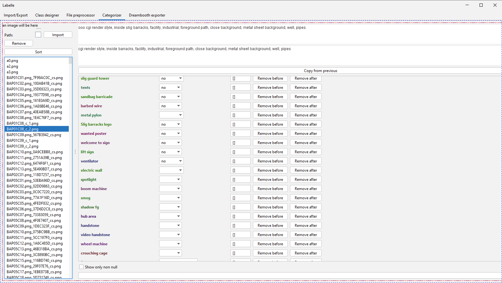

# Labelle

Labelle is an ~~elegant~~ quickly hacked together tool made to help with manual classification of multiple 
images across known categories focused on multi-concepts Dreambooth training.

## Later goals (hopefully achieved one day)

- unhack the code
- support more export formats
- support input from automatic classifying tools
- make it less brittle